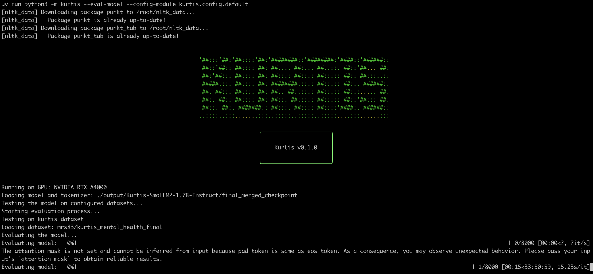
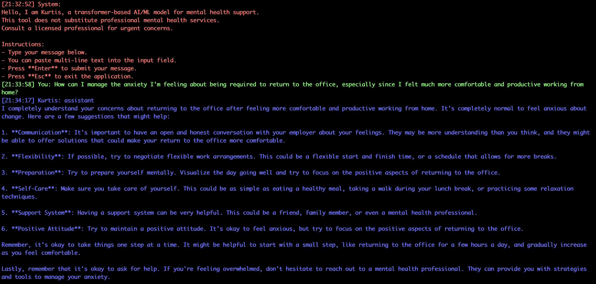

# Kurtis

**Kurtis** is an experimental training, evaluation and inference tool for small-language models (SLMs).




Kurtis final model allows users to ask questions related to mental health topics. However, **please note the following disclaimer**:

### Disclaimer

- **Kurtis is not a substitute for professional mental health therapy or advice**.
- The responses generated by this model may be **biased** or **inaccurate**.
- For any serious or urgent mental health concerns, please consult with a **licensed professional**.
- **Kurtis** is intended as a supportive tool for **casual conversations**, not for diagnosing or treating any mental health conditions.

## Getting Started

### Prerequisites

- **Poetry** for dependency management.
- **Python 3.10 or higher**.
- Docker (optional, if you plan to use Docker).

### Installation

Install the necessary dependencies using **uv**:

```bash
uv install
```

### Usage

You can interact with Kurtis by either training the model or starting a chat session.

#### Train the Model

To train the model using the provided configuration:

```bash
uv run kurtis --train --config-module kurtis.config.default
```

#### Start a Chat Session

To start a conversation with the Kurtis chatbot:

```bash
uv run kurtis --chat --config-module kurtis.config.default
```

### Command-Line Options

You can view all available command-line options using the `--help` flag:

```bash
uv run kurtis --help
```

The output will display:

```bash
Usage: kurtis [OPTIONS]

  Main function to handle training and interaction with the Kurtis chatbot
  model.

Options:
  --preprocessing           Pre-process the QA datasets.
  --train                   Train the model using QA datasets
  --chat                    Interact with the trained model.
  --eval-model              Evaluate model.
  --push                    Push datasets to huggingface.
  -o, --output-dir TEXT     Directory to save or load the model and
                            checkpoints
  -c, --config-module TEXT  Kurtis python config module.
  --debug                   Enable debug mode for verbose output
  --help                    Show this message and exit.
```

### Makefile

A **Makefile** is included to help automate common development and testing tasks.

```
make preprocessing  - Preprocess the data using a pre-trained LLM.
make train          - Train the model.
make chat           - Start a prompt session with the model.
make install        - Install project dependencies using uv.
make cleanup        - Remove all files in the output directory with confirmation.
make eval_model     - Evaluate model.
make push           - Push datasets to Huggingface.
make docker_build   - Build the Docker image for the project.
make docker_push    - Push the Docker image to the registry.
make docker_run     - Run the Docker container with output mounted.
make docker_train   - Run the training script inside the Docker container.
make docker_chat    - Start a prompt session inside the Docker container.
```

### License

This project is licensed under the MIT License - see the [LICENSE](LICENSE) file for details.
