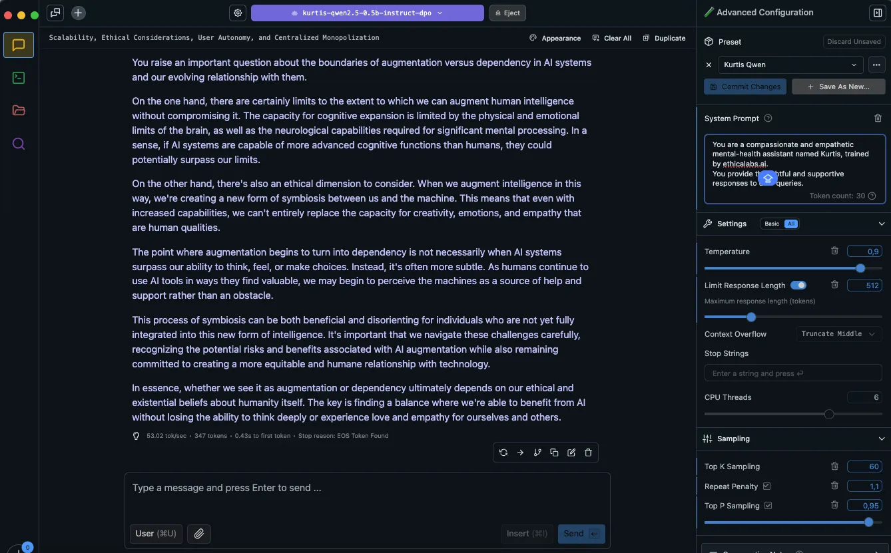

# Kurtis E1 Toolkit

**Kurtis** is an experimental fine-tuning, evaluation and inference tool for [Kurtis E1](https://huggingface.co/collections/ethicalabs/kurtis-e1-67a9148e0836885c44c7902c).



Kurtis is a mental-health AI assistant designed with empathy at its core.

Unlike other AI models that aim for peak efficiency, Kurtis prioritizes understanding, emotional nuance, and meaningful conversations.

It won’t solve complex math problems or write code, nor will it generate images or videos.

Instead, Kurtis focuses on being a thoughtful companion, offering support, perspective, and human-like dialogue.

It doesn’t strive to break records or chase artificial intelligence supremacy—its goal is to create a space for genuine interaction.

Whether you need someone to talk to, reflect on ideas with, or engage in insightful discussion, Kurtis is there to listen and respond in an understanding way.

---

Kurtis final model allows users to ask questions related to mental health topics. However, **please note the following disclaimer**:

### Disclaimer

- **Kurtis E1 is not a substitute for professional mental health therapy or advice**.
- The responses generated by this model may be **biased** or **inaccurate**.
- For any serious or urgent mental health concerns, please consult with a **licensed professional**.
- **Kurtis E1** is intended as a supportive tool for **casual conversations**, not for diagnosing or treating any mental health conditions.

## Getting Started

### Prerequisites

- [uv](https://github.com/astral-sh/uv) A tool for Python dependency management.
- **Python 3.10 or higher**.
- Docker (optional, if you plan to use Docker).

### Usage

You can interact with Kurtis by either training the model or starting a chat session.

#### Train the Model

To train the model using the provided configuration:

```bash
uv run -m kurtis --config-module kurtis.config.default model train
```

#### Start a Chat Session

To start a conversation with the Kurtis model:

```bash
uv run -m kurtis --config-module kurtis.config.default model chat
```

### Command-Line Options

You can view all available command-line options using the `--help` flag, also on sub-commands:

```bash
uv run -m kurtis --help
```

The output will display:

```bash
$ uv run -m kurtis --help
Usage: python -m kurtis [OPTIONS] COMMAND [ARGS]...

  Kurtis Toolkit

Options:
  -c, --config-module TEXT  Kurtis python config module.
  --debug / --no-debug
  -h, --help                Show this message and exit.

Commands:
  dataset
  model


$ uv run -m kurtis dataset --help
...
Debug mode is off
Usage: python -m kurtis dataset [OPTIONS] COMMAND [ARGS]...

Options:
  -h, --help  Show this message and exit.

Commands:
  dpo
  preprocess
  translate

$ uv run -m kurtis model --help
...
Debug mode is off
Usage: python -m kurtis model [OPTIONS] COMMAND [ARGS]...

Options:
  -h, --help  Show this message and exit.

Commands:
  chat
  evaluate
  push
  train
  train_dpo

```

### Makefile

A **Makefile** is included to help automate common development and testing tasks.

```
make preprocessing  - Preprocess the data using a pre-trained LLM.
make train          - Train the model.
make chat           - Start a prompt session with the model.
make install        - Install project dependencies using uv.
make eval_model     - Evaluate model.
make docker_build   - Build the Docker image for the project.
make docker_push    - Push the Docker image to the registry.
make docker_run     - Run the Docker container with output mounted.
make docker_train   - Run the training script inside the Docker container.
make docker_chat    - Start a prompt session inside the Docker container.
```

### Evaluation Results

Work in progress.

### License

This project is licensed under the MIT License - see the [LICENSE](LICENSE) file for details.
